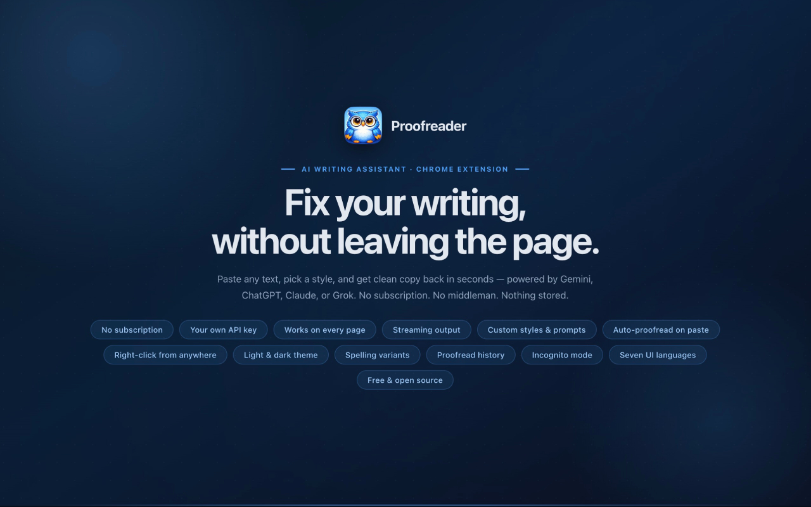
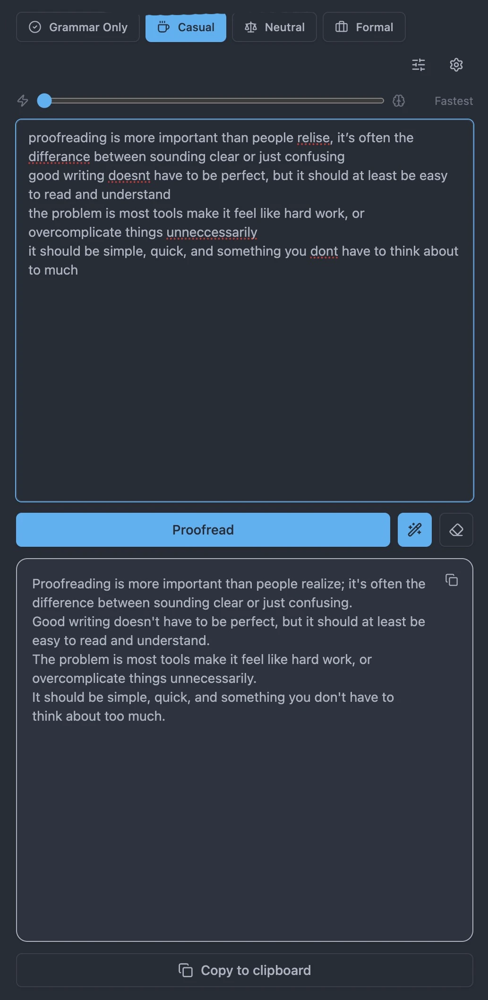
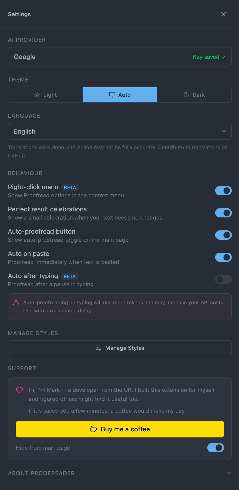
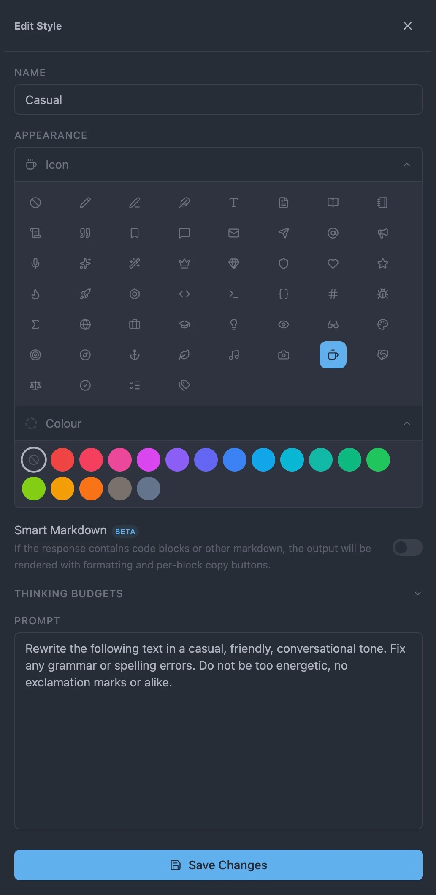

<p align="center">
  
</p>

<p align="center">
  <strong>Your writing, sharper. Instantly.</strong><br>
  A Chrome side panel that connects directly to your AI provider and fixes your text — with no accounts, no subscriptions, and nothing stored anywhere but your own machine.
</p>

<p align="center">
  <a href="#">
    
  </a>
</p>

---

<p align="center">
  
  
  
</p>

---

## Built for writers who get things done

Proofreader lives in your browser's side panel, always one click away. Paste in anything — an email, a Slack message, a commit note, a blog post — and get back clean, corrected prose in seconds.

No app switching. No copying text into a chat window. No AI trying to have a conversation with you about it.

---

## Your AI, your rules


### Four AI providers. Zero lock-in.

Use whichever AI you already pay for, or the one that's free right now.

Proofreader works with four major AI providers. Bring your own API key and connect directly — there's no middleman server, no account to create, and no one else sees your text.

- **Google (Gemini)** — Free tier with generous limits. Good for everyday proofreading.
- **OpenAI (ChatGPT)** — GPT-4o-mini. Fast and cost-effective for light editing.
- **Anthropic (Claude)** — Strong at nuanced, precise rewrites.
- **xAI (Grok)** — A capable alternative with a growing API ecosystem.

Switch between providers at any time. Each one keeps its own API key.

---

## Styles


### Write for the room, not just the rulebook

Different text needs different handling. Styles let you define exactly how each piece gets treated.

Each style has its own prompt, tone, and thinking level. Four are built in, and you can add as many as you want.

**Built-in styles:**

- **Grammar Only** — Fixes spelling and grammar, nothing else
- **Casual** — Relaxed, conversational tone
- **Neutral** — Clear and balanced for general use
- **Formal** — Polished and professional

**Each style can be customised with:**

- A custom prompt (tone, domain, format)
- Colour and icon for quick recognition
- Smart Markdown rendering (with copy buttons for code blocks)
- Per-provider thinking levels

---

## Thinking controls

### Fast when you need speed. Deep when you need precision.

Some requests need more thought than others. Proofreader lets you tune that per style and per provider.

- **Gemini** — Token budget slider (0 to 8192)
- **OpenAI & Claude** — Low, Medium, High effort modes
- **Grok** — No additional reasoning layer

You can also override thinking per session without changing your saved styles.

---

## Auto-proofread

### Set it and forget it

Proofreader can run automatically in the background.

- **Auto on paste** — Starts instantly when text is pasted
- **Auto after typing (Beta)** — Triggers after a short pause (configurable)
- **Smart change detection** — Avoids unnecessary API calls for minor edits
- **Timer indicator** — Subtle countdown so you know when it's about to run

---

## History

### Every session, one click away

When history is enabled, Proofreader saves a log of every proofread session — input, output, style used, and timestamp. Everything is stored locally on your machine and never leaves it.

- **Searchable** — Filter your history by content or style name
- **Re-use any entry** — Load a previous result straight back into the editor
- **Per-item delete** — Remove specific entries, or clear the whole log at once
- **Disable cleanly** — Choose to wipe history when disabling, or keep it as-is

---

## Incognito Mode

### Off the record, when you need it

Flip on Incognito Mode for sessions you don't want saved. The UI shifts to a near-black theme so it's immediately obvious you're in private mode, and nothing gets logged to history — even if history saving is otherwise enabled.

- Toggle it from the toolbar without touching your saved settings
- Theme reverts to normal the moment you turn it off
- History button is hidden when history saving is disabled

---

## Context menu

### Right-click. Done.

Proofread selected text on any page without opening the panel.

Enable the context menu and choose a style directly from the right-click menu. Results can appear in the panel or replace the original text in place.

---

## Languages


The interface is available in seven languages: English, French, Spanish, Italian, German, Portuguese, and Dutch. Your browser language is detected automatically, or you can pick one manually.

---

## Settings


A tool that stays out of your way.

- Light, dark, and auto themes
- Per-provider API key storage
- Clear error messages (with optional raw output for debugging)
- One-click copy for all outputs
- Proofread history with search (stored locally, fully optional)
- Incognito mode for off-the-record sessions
- No subscriptions or locked features

---

## Sample requests included

Proofreader includes **5 sample requests** so you can see how it works straight away — no API key needed. These use a shared API key on a slower public endpoint, just for demo purposes.

Proofreader itself is completely free and open source. To use it properly, just add your own API key from any supported provider. Buying a coffee is appreciated but doesn't grant access to anything — the app is fully functional with your own key.

---

## Privacy

### Your text goes to the AI. Nowhere else.

Proofreader makes a direct API call from your browser to your chosen provider.

- No servers (except the optional demo mode — see below)
- No accounts
- No tracking
- No data storage by default — history is opt-in and stored only on your machine
- Incognito mode skips saving entirely for sensitive sessions

Your API keys stay on your machine. Your text is never stored or logged. Demo mode uses a shared backend for 5 requests only — see the full [Privacy Policy](PRIVACY.md) for details.

This is an open-source side project. You can check the code if you want to verify how it works.

---

## Development / Installation

If you want to run or contribute:

1. Get an API key (e.g. [Gemini](https://aistudio.google.com/apikey), [OpenAI](https://platform.openai.com/api-keys), [Anthropic](https://console.anthropic.com/settings/keys), or [xAI](https://console.x.ai))
2. Install and build:
```
npm install
npm run build
```
3. Open Chrome and go to `chrome://extensions`
4. Enable Developer Mode
5. Click **Load unpacked** and select the `extension/` folder

The extension will prompt for an API key on first launch.

---

## Legal

- [Privacy Policy](PRIVACY.md)
- [MIT Licence](LICENSE)

---

## Author

Mark Notton

<a href="https://buymeacoffee.com/marknotton">
  
</a>
